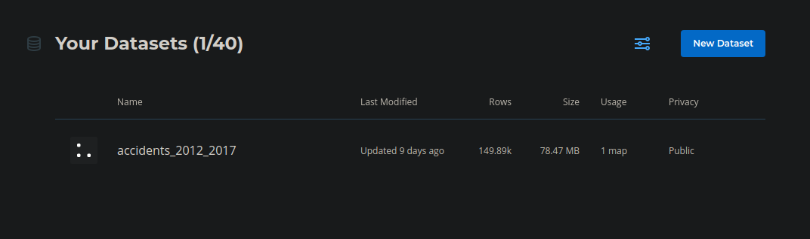
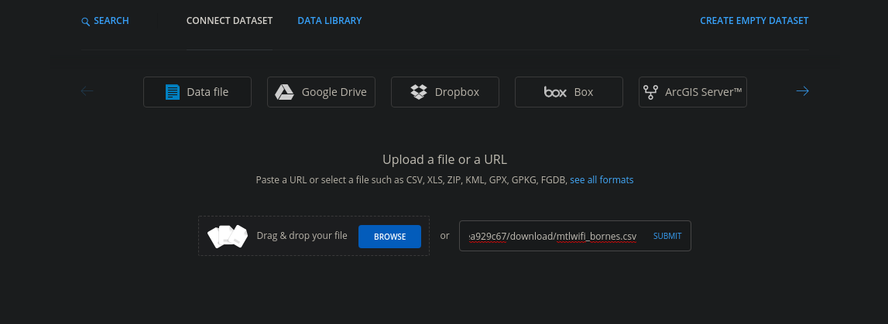

# Carto Maps for NG Frontend

This repository contains config files for configuring map application in [CKAN NG Frontend](#)

## Getting started

### Configure plugin

**NOTE** If you are running *CKAN Cloud* you can ignore this section

1. [Install *CKAN NG Frontend*](#)
2. Enable carto plugin in your *NG Frontend* environment, along with your carto API credentials:

```
GIT_OWNER=starsinmypockets
CARTO_USER=test-user-123
```

Optionally you can provide a `CARTO_APIKEY`. By default carto's `public_default` key which can access all public resources will be used.

## Using Carto

* Add a data resource to carto
In your carto dashboard, add a new Dataset:


* Upload or add link to data resource 

* Check for geo-encoding
Geo-encoding data is storeid in carto in the `the_geom` column. 
This column should be populated during data import.


### Create map instance in carto


Use carto's map builder to generate a map based on your data.

### Export iframe

With your map completed, check out [how to configure git](#git) (below) to display your map on your site.

### SIDEBAR: Geocoding data

Data needs to have a `the_geom` column with a valid geometry object.

See:

https://carto.com/developers/data-services-api/reference/#geocoding-functions

https://carto.com/help/working-with-data/carto-functions/

Or via SQL:

https://{USER_NAME}.carto.com/api/v2/sql?q=UPDATE {TABLE_NAME} SET the_geom = CDB_LatLng({LAT_COLUMN}, {LON_COLUMN})&api_key={API_KEY_WITH_WRITE_ACCESS}

https://paulwalker-datopian.carto.com/api/v2/sql?q=UPDATE accidents_2012_2017 SET the_geom = CDB_LatLng(loc_lat, loc_long)&api_key=Mef_QoqGyQRspq9AumGvbg

Auth: Note that the token used needs to be associated with an API user with write / update permissions

### git

1. Create a git repository called `maps`
2. For each map on your site, add a directory to the repository with the name of your map -- this will be used in the path for frontend.

For example your repository directory could look like this:
```
./
../
.git/
README.md
accidents/
  config.json
property-value/
  config.json
311-calls-2018/
  config.json
```
Associated maps will be available at:
* `https://YOURSITE.com/maps/accidents`
* `https://YOURSITE.com/maps/property-value`
* `https://YOURSITE.com/maps/311-calls-2018`

3. Add a `config.json` file to each map directory. If your map was exported as an iframe, the config should look like this:

#### Page layout

Optionally you can add the following html files to your repository:

**header.html** -- will display above the map

```json
{
  "type": "iframe",
  "url": "https://paulwalker-datopian.carto.com/builder/adb1a36d-85e0-488a-81dc-bf28530b876a/embed"
}
```

### Via cartoVL -- ALPHA

You can have a go at this too, note that it is in Alpha and may not be stable.

```json
{
  "type": "cartoVL",
  "map": {
    "container": "map",
    "style": "https://basemaps.cartocdn.com/gl/voyager-gl-style/style.json",
    "center": [-73.5673, 45.5017],
    "zoom": 12
  },
  "layers": [
    {
      "source": "accidents_2012_2017",
      "viz": "color: ramp(buckets(prop('nb_victimes_total'), [1, 1, 2, 3, 4, 5, 10, 100]), Prism)"
    }
  ]
}
```

#### type

* `cartoVL`

#### map 

mapboxgl [Map options object](https://docs.mapbox.com/mapbox-gl-js/api/#map)  

Some optional attributes include:

- **container** the id of the div to load the map, should be `map` to use the default plugin template
- **style** path to carto basemap style object
- **center** geographic center of map in `[LONG, LAT]` format

##### example

```json
"map": {
  "container": "map",
  "style": "https://basemaps.cartocdn.com/gl/voyager-gl-style/style.json",
  "center": [-73.5673, 45.5017],
  "zoom": 12
},
```

For more detailed options see the [mapboxgl docs](https://docs.mapbox.com/mapbox-gl-js/api/#map)

#### layers

An array of layer objects consisting of:

- **source** - the name of the carto resource
- **viz** a Viz definition based on [carto expressions](https://carto.com/developers/carto-vl/reference/#cartoexpressions) -- **USE STRING SYNTAX NOT JAVASCRIPT SYNTAX**

##### example

```json
"layers": [
  {
    "source": "accidents_2012_2017",
    "viz": "color: ramp(buckets(prop('nb_victimes_total'), [1, 10, 100]), Prism)"
  }
]
```
